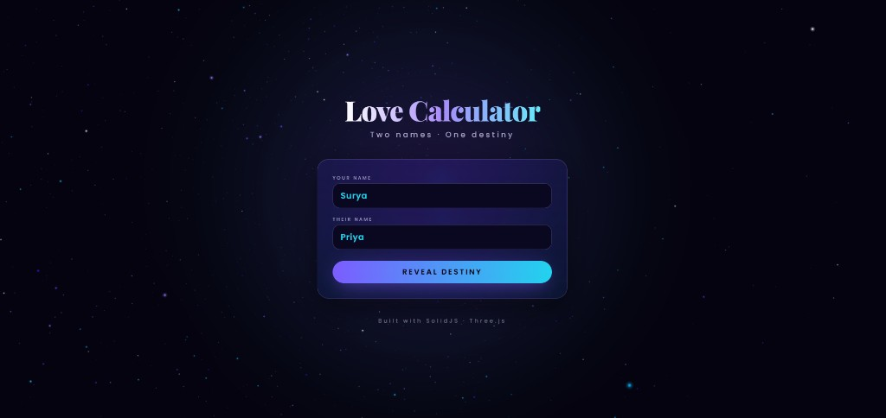
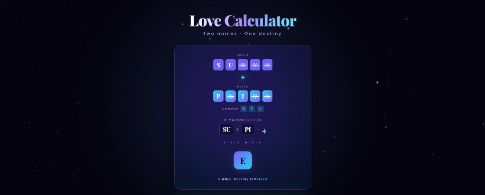
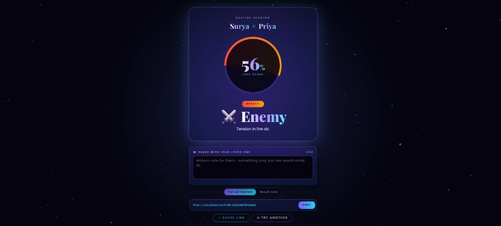

<h1 align="center">Love Calculator</h1>

<p align="center">
  Cosmic FLAMES love calculator. Two names, one destiny — animated with SolidJS, Three.js starfield, glassmorphic UI, and shareable encoded links with custom love notes.
</p>

<p align="center">
  <a href="https://pravinlsiye.github.io/Love-Calculator/"><b>Live demo</b></a>
  ·
  <a href="https://github.com/Pravinlsiye/Love-Calculator">Repo</a>
  ·
  <a href="https://github.com/Pravinlsiye">@Pravinlsiye</a>
</p>

<p align="center">
  
  
  
  
  
</p>

---

## Screenshots

### Home



### Animated FLAMES elimination



### Result + Share with custom message



---

## Features

- **Modernized FLAMES algorithm** — strike common letters, count remaining, eliminate F·L·A·M·E·S cyclically until one survives. Combined with overlap ratio, `LOVES` letter bonus, and length symmetry into a 0–100% love score.
- **Step-by-step animation** — letter strike-outs, common-letter chips, FLAMES tile elimination with traveling counter, winner reveal, animated result card.
- **Three.js starfield background** — 2400 stars distributed on a sphere, custom shader with sine wobble + size attenuation, additive blending, mouse parallax, ambient nebula plane.
- **Shareable encoded links** — names are base64url-encoded into the URL hash so they aren't human-readable. Two variants:
  - `#l=<token>` — recipient sees the full animation
  - `#l=<token>&f=1` — skips animation, jumps straight to the result
- **Custom love note** — sender can attach a 240-char message that's encoded into the same token. Recipient sees it as an animated love letter (word-by-word reveal, signed in `Dancing Script` font).
- **Cosmic theme** — midnight base, violet/cyan accents, glassmorphism, shimmer text, conic-gradient result ring.

---

## Tech stack

- [SolidJS](https://solidjs.com) + TypeScript
- [Vite](https://vite.dev) build
- [Tailwind CSS](https://tailwindcss.com) (custom keyframes: `cosmicPulse`, `auroraDrift`, `quoteFloat`, `gentleBob`, `floatUp`, `heartbeat`, `shimmer`)
- [solid-motionone](https://github.com/solidjs-community/solid-motionone) — declarative animations
- [three](https://threejs.org) — WebGL background

---

## Project structure

```
src/
  App.tsx              # Form, share-load on mount, layout
  LoveAnimation.tsx    # Strike + count + FLAMES elimination + share bar + incoming message
  ResultCard.tsx       # Animated % ring, category, sparkles
  ThreeBackground.tsx  # WebGL starfield
  loveLogic.ts         # Sanitize, pair-match, FLAMES eliminate, score
  share.ts             # base64url encode/decode of (name1, name2, message?)
  index.css            # Globals, fonts, autofill overrides
  index.tsx            # Mount
```

---

## Development

```bash
npm install
npm run dev      # http://localhost:5173
npm run build    # → dist/
npm run preview  # preview built bundle
```

---
